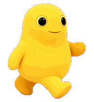
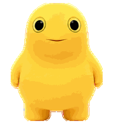
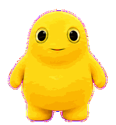
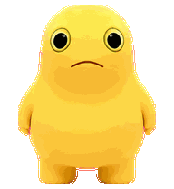
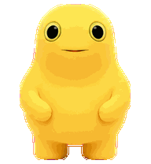
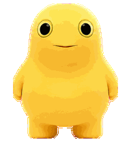
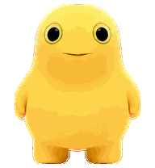

# 可爱奶蛙图集逐行说明

成品图集为 `1536 × 2288`，由 `8 列 × 11 行`、每格 `192 × 208` 组成。下列触发说明按当前 Windows Codex `26.707.3748.0` 核对；其他版本或平台可能不同。

标准状态的 GIF 按当前“可爱奶蛙（慢动作）”客户端的真实逐帧时长制作。`failed`、`waiting`、`running`、`review` 会持续循环到任务状态改变；移动、挥手和跳跃播放 3 轮后回到慢速待机。

## 第 0 行：idle（待机）

- 功能：六帧双眼始终自然睁开、双脚保持落地；以轻柔呼吸、1–2 像素重心回摆、极小歪头和腰部以下的低位手臂浮动形成连贯闭环，不再使用胸前合手的大幅姿势。
- 帧位：第 0–5 格为六帧待机循环；第 6 格为中性正面备用格；第 7 格为空。
- 触发：没有更高优先级状态时使用，也是其他动画结束后的公共回退。
- 播放：当前 Windows 客户端将基础时长放慢 6 倍，整轮约 `6.60 秒`并循环。

## 第 1 行：running-right（向右移动）

- 功能：左右腿交替承重、对侧手臂配合摆动的向右步态。
- 触发：拖动桌面宠物向右，并达到水平移动阈值。
- 播放：8 帧一轮，播放 3 轮约 `3.18 秒`后回到待机。

## 第 2 行：running-left（向左移动）

- 功能：与向右步态对应的向左八帧交替行走。
- 触发：拖动桌面宠物向左，并达到水平移动阈值。
- 播放：8 帧一轮，播放 3 轮约 `3.18 秒`后回到待机。

## 第 3 行：waving（挥手问候）

- 功能：抬手、开心笑、放下手的首次问候动作。
- 触发：某个宠物 ID 第一次打开悬浮宠物时的 `first-awake` 问候，不由悬停或点击触发。
- 当前情况：可爱奶蛙的首次问候已经消费，正常情况下不会再次自动触发。
- 播放：4 帧一轮约 `0.90 秒`，播放 3 轮共约 `2.70 秒`后回到待机；比旧版略慢，抬手、笑脸和收手都能看清。

## 第 4 行：jumping（跳跃）

- 功能：双脚软弹蓄力、对称蹬地、紧凑收腿腾空、圆润下落与双脚缓冲落地；手臂沿连续弧线摆动，不出现僵硬 T-pose。
- 触发：鼠标进入或悬停宠物本体；当前逻辑固定触发跳跃，不会随机选择动作。
- 播放：5 帧一轮，播放 3 轮约 `2.52 秒`后回到待机；移出再移入会重新触发。

## 第 5 行：failed（失败/受阻）

- 功能：从委屈、失落到稍微恢复的失败反应。
- 触发：当前最高优先级可见任务通知为 `failed`，界面通常显示为 `Blocked`。
- 播放：8 帧一轮约 `1.952 秒`，在 `failed` 状态持续循环，直到状态改变或鼠标悬停动作结束后回到待机。

## 第 6 行：waiting（等待输入）

- 功能：合手、歪头和期待表情，表示正在等你回应。
- 触发：任务等待用户问题回答、命令或文件审批、权限请求及其他确认。
- 播放：6 帧一轮约 `2.24 秒`，在 `waiting` 状态持续循环；末帧额外停留，让歪头与期待表情更柔和。

## 第 7 行：running（正在工作）

- 功能：专注思考、合手处理任务；这里的 `running` 表示任务运行，并不是在地面奔跑。
- 触发：当前任务处于 `running`，也就是 Codex 正在思考、执行或处理。
- 播放：6 帧一轮约 `1.92 秒`，在 `running` 状态持续循环；已放慢合手、思考和微笑之间的切换，避免快速抖动。

## 第 8 行：review（完成待查看）

- 功能：左右观察、歪头和满意微笑，表示结果已经准备好。
- 触发：任务处于 `review`，通常表示已完成但结果仍待查看或未读。
- 播放：6 帧一轮约 `2.40 秒`，在 `review` 状态持续循环；这是本次重点放慢的状态，左右观察、闭眼和满意微笑都有足够停留时间。

## 第 9 行：look A（上半圈观察方向）

- 功能：按目标位置直接选择一个静态格，不会把整行当动画播放。
- 格位：`000° 上`、`022.5° 右上`、`045° 右上`、`067.5° 右上`、`090° 右`、`112.5° 右下`、`135° 右下`、`157.5° 右下`。
- 当前 Windows：普通鼠标不会产生所需的 computer-use 光标事件，因此正常使用中不可达。

## 第 10 行：look B（下半圈观察方向）

- 功能：与第 9 行共同构成顺时针 16 向观察，同样只显示被选中的单格。
- 格位：`180° 下`、`202.5° 左下`、`225° 左下`、`247.5° 左下`、`270° 左`、`292.5° 左上`、`315° 左上`、`337.5° 左上`。
- 当前 Windows：与第 9 行相同，普通鼠标路径下不可达。

## 当前优先级

运行时选择顺序为：`方向观察 > 拖动移动 > 鼠标悬停跳跃 > 任务状态 > 待机`。启用“减少动态效果”时，所有状态都只显示其第 1 帧。
