# 可爱奶蛙图集与自然动作说明

本页说明自然动作版 `3.0.0`，当前适配 Codex Windows `26.917.9434.0`。图集仍为 `1536 × 2288`，`8 列 × 11 行`，单格 `192 × 208`；行、列均从 **0** 开始计数。

自然动作会复用、重排已有帧，个别动作跨行取帧，并对裁切后的单格施加轻微脚底锚定变形。帧与时长的准确配置见 [motion-profile.mjs](runtime/motion-profile.mjs)，可播放的实际效果见 [互动预览](previews/natural.html)；预览启动方式见 [README](README.md#互动预览)。旧版逐行 GIF 是历史慢动作记录，不能表示新的完整状态与互动逻辑。

## 状态与节奏

| 状态或动作 | 进入时的短反应 | 后续播放 |
| --- | ---: | --- |
| 待机 `idle` | 无 | 5.10 秒睁眼呼吸循环，闲置约 20 秒后偶尔张望 |
| 左右移动 `running-left/right` | 无 | 1.02 秒八帧步态；移动结束后用约 0.26 秒收脚 |
| 工作 `running` | 1.90 秒 | 6.30 秒安静专注循环 |
| 等待 `waiting` | 1.41 秒 | 8.40 秒合手期待循环 |
| 完成待查看 `review` | 1.70 秒 | 7.93 秒安静等候循环 |
| 受阻 `failed` | 2.38 秒 | 7.22 秒低落姿势循环 |
| 跳一下 | 1.02 秒 | 单次动作后恢复最新任务状态 |
| 挥手 | 1.06 秒 | 单次动作后恢复最新任务状态 |
| 笑着招呼 | 1.43 秒 | 单次动作后恢复最新任务状态 |

表内互动时长不含约 0.26 秒的“先注意到你”前奏，也不含 280 毫秒悬停等待。四种任务状态保持到客户端报告新状态；短反应结束后不会因为播放次数耗尽而自行变成待机。

## 第 0 行：idle（待机）

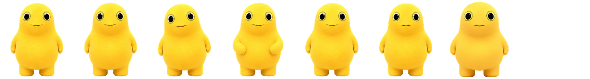

第 0–5 格为六帧睁眼待机，第 6 格为中性正面备用，第 7 格为空。双脚落地，以呼吸、微小重心回摆和低位手臂浮动陪伴。自然版完整保留六帧睁眼状态；偶尔插入的好奇张望也只使用睁眼帧。

## 第 1、2 行：左右移动

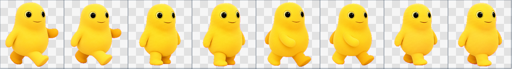

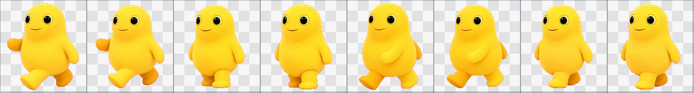

两行各有八帧，对应右、左方向。左右腿交替承重，并配合对侧摆臂；自然版保持原有帧序。客户端进入拖动移动状态时播放步态，移动结束后先收脚，再恢复当时的任务状态。

## 第 3 行：waving（挥手与笑着招呼）

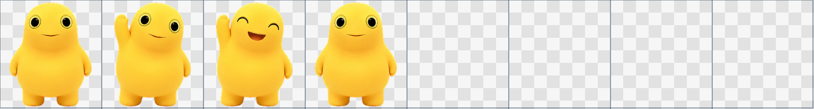

第 0–3 格分别提供正面、举手、闭眼张嘴笑、收手姿势。自然版将其编排为一次完整问候，也将第 2 格的举手笑脸用于带轻微身体回弹的“笑着招呼”。后者不是新增捧腹笑画稿。

客户端首次唤醒问候和自然版悬停轮换都可使用本行动作；首次唤醒事件是否再次发生由客户端决定。

## 第 4 行：jumping（软弹一下）

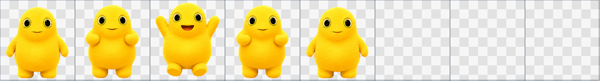

第 0–4 格提供准备、蓄力、腾空、落地与恢复姿势。自然版只跳一次，在蓄力和落地时加入轻微压扁与回弹；脚底附近作为变形锚点。腾空帧原本已有收腿离地，不额外叠加跳跃位移。

## 第 5 行：failed（失败或受阻）

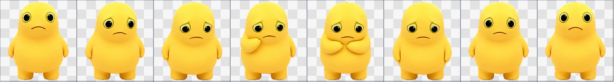

先完整表达一次委屈与捧脸反应，再主要保留第 5–7 格的安静低落姿势。这样仍能读出受阻状态，又避免频繁重复强烈表情。减少动态效果时使用第 6 格。

## 第 6 行：waiting（等待回应）

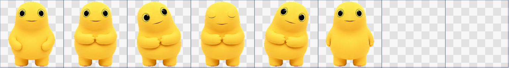

先合手、歪头并短暂闭眼，再以第 1 格的合手姿势安静等待，偶尔向两边轻轻歪头。表示任务正在等待回答、确认或其他输入。减少动态效果时使用第 1 格。

## 第 7 行：running（正在工作）

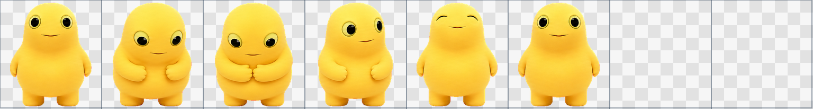

这里的 `running` 表示处理任务。自然版以第 2 格低头合手为主，间隔较长地松手、抬眼，再继续专注。减少动态效果时仍使用第 2 格。

第 4 格的闭眼满意笑也用于完成状态的一次短反应和静态完成姿势。

## 第 8 行：review（完成待查看）

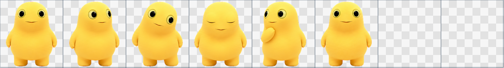

先侧看、歪头，并结合第 7 行第 4 格的满意微笑表达完成；随后主要使用本行第 5 格站好等人查看，偶尔侧望。减少动态效果时使用第 7 行第 4 格，便于与待机区分。

## 第 9、10 行：16 向观察

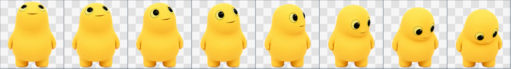

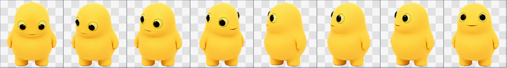

每格是一个观察方向，通常按目标选择，不将整行连续播放。角度从正上方开始，按顺时针每格增加 `22.5°`：第 9 行为 `0°–157.5°`，第 10 行为 `180°–337.5°`。

自然版利用这些已有帧，在悬停回应前短暂看向局部指针位置，也在闲置时插入轻微张望。此功能只接收宠物区域内的指针事件，**不等于全桌面鼠标追踪**。客户端额外提供的方向观察事件是否可用，仍由平台与版本决定。

## 互动与恢复

- 鼠标进入并停留 280 毫秒后触发；提前离开则取消。连续有效悬停按“跳一下 → 挥手 → 笑着招呼”轮换，每次只回应一次。
- 冷却从动作触发开始计算，为 4.2 秒。停在身上不会自动连发；冷却过后需要再次进入。
- 拖动优先使用左右步态，不触发悬停招呼；停止后完成收脚。
- 互动期间记录客户端的新任务状态，动作结束后恢复该状态；因此任务完成、等待与受阻信息不会因互动丢失。
- 启用减少动态效果时，停止循环、悬停回应和张望，保留能区分任务的静态姿势。

旧版 `26.707.3748.0` 的“三轮后待机”和固定悬停跳跃属于历史慢动作方案，不用于以上自然动作行为。
