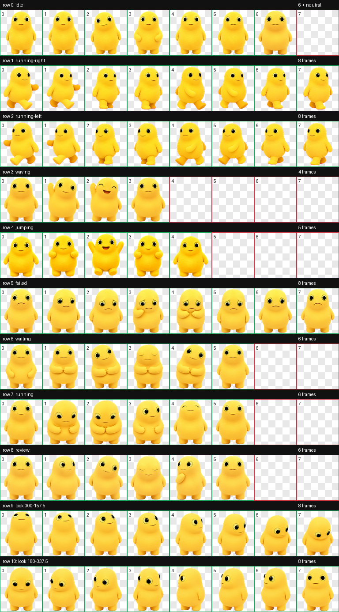
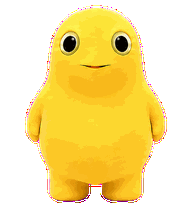
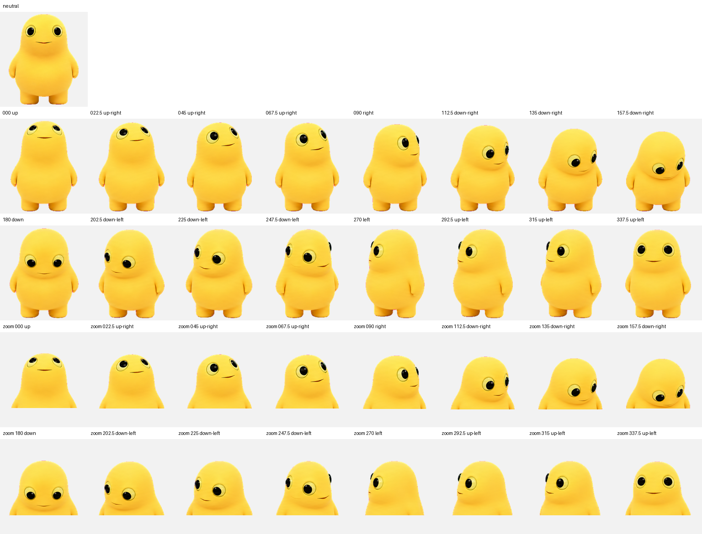

# 可爱奶蛙 / Cute Naiwa

一只圆润、柔软、爱卖萌的黄色 Codex v2 动态桌面宠物。



## 动画特点

- 原地待机：六帧始终睁着亮晶晶的大眼睛，双脚稳稳落地，通过轻柔呼吸、极小重心回摆、轻微歪头和低位手臂浮动自然卖萌。
- 左右行走：完整八帧步态，左右腿交替承重，并配合对侧手臂摆动。
- 跳跃：双脚软弹蓄力、对称起跳、紧凑腾空、圆润下落和双脚缓冲落地，手臂沿自然弧线跟随。
- 其他状态：挥手、失败、等待、工作、审阅，以及 16 个方向的观察帧。

当前“可爱奶蛙（慢动作）”运行副本采用逐状态差异化节奏：

| 状态 | 每轮时长 |
| --- | ---: |
| idle | 6.60 秒 |
| running-right / running-left | 1.06 秒 |
| waving | 0.90 秒 |
| jumping | 0.84 秒 |
| failed | 1.952 秒 |
| waiting | 2.24 秒 |
| running | 1.92 秒 |
| review | 2.40 秒 |

`failed`、`waiting`、`running`、`review` 会持续循环到任务状态改变；移动、挥手与跳跃播放三轮后回到待机。

| 向右行走 | 向左行走 |
| --- | --- |
|  |  |

| 睁眼待机 | 悬停跳跃 |
| --- | --- |
|  |  |

## 安装

在 PowerShell 中进入本仓库目录，然后运行：

```powershell
$destination = Join-Path $env:USERPROFILE ".codex\pets\xiaohuangtuan"
New-Item -ItemType Directory -Force -Path $destination | Out-Null
Copy-Item .\pet.json, .\spritesheet.webp -Destination $destination -Force
```

随后在 Codex 的宠物选择器中选择“可爱奶蛙”。若界面没有立即刷新，请重启 Codex。

## 当前 Windows 动画节奏补丁

`runtime/` 保存本机当前版本使用的运行时补丁源文件、启动器和真实时长预览脚本。它针对 Codex Windows `26.707.3748.0`，用于保留慢速状态循环、鼠标悬停跳跃后回到待机等行为；升级 Codex 后需要重新核对补丁目标和哈希，不能直接假定兼容。

桌面上的 `Codex 可爱奶蛙（慢动作）.lnk` 已指向当前经过验证的用户空间运行副本。运行时不会修改 Microsoft Store 安装目录。

## 图集规格

- Codex `spriteVersionNumber: 2`
- WebP RGBA 图集：`1536 × 2288`
- 布局：`8 列 × 11 行`
- 单格尺寸：`192 × 208`
- 宠物 ID：`xiaohuangtuan`

图集包含全部 9 种标准动画状态与 16 个观察方向。具体触发方式由 Codex 客户端的版本和平台决定；方向观察帧在部分 Windows 版本中可能尚无可达事件源。

逐行动画、功能及当前 Windows 触发方式见 [`ANIMATION_ROWS.md`](ANIMATION_ROWS.md)。



## 质量检查

发布图集已通过尺寸、透明通道、标准帧占用、行走循环、全睁眼待机、双脚软弹跳跃以及非目标格逐像素保留检查。去除本机路径后的结果见 [`qa/validation-summary.json`](qa/validation-summary.json)，改动范围见 [`qa/preservation-gate.json`](qa/preservation-gate.json)。逐状态速度结论见 [`qa/runtime-speed-review.json`](qa/runtime-speed-review.json)，本机部署验证见 [`qa/deployment-verification.json`](qa/deployment-verification.json)。

本宠物在仓库所有者提供的视觉参考基础上，经 AI 辅助创作和人工筛选、组装与动作校正完成。

## 许可证

除非文件中另有说明，本仓库内容以 [MIT License](LICENSE) 发布。
# codex_pets_naiwa-cute
