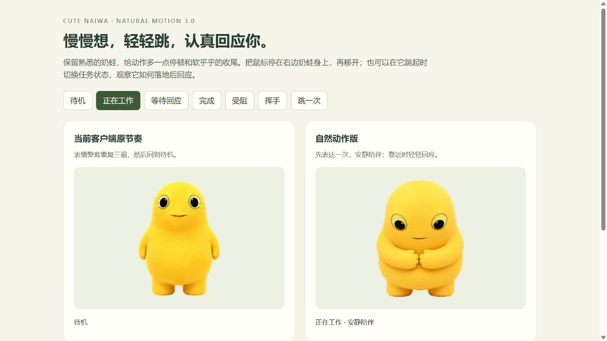

# 可爱奶蛙 / Cute Naiwa

一只圆润、柔软、爱卖萌的黄色 Codex 桌面宠物。自然动作版保留原有形象和图集，重新编排停顿、反应与收尾，让奶蛙安静陪伴，也会轻轻回应你。

## 自然动作版 3.0

- **睁眼陪伴**：轻柔呼吸，闲置约 20 秒后偶尔张望；待机始终睁眼。
- **认真表达**：工作、等待、完成和受阻先做一次短反应，再保持各自的安静动作，直到任务状态改变。
- **靠近时回应**：鼠标在身上停留约 280 毫秒，奶蛙先瞥一眼，再依次用软弹一下、挥手、笑着招呼回应。每次只做一个动作，冷却 4.2 秒；快速掠过不会触发。
- **自然收尾**：跳跃有轻微蓄力和落地回弹；互动结束后回应最新任务状态。拖动时保留左右腿交替的八帧步态，停止后先收脚站稳。
- **安静模式**：启用“减少动态效果”时，以不同静态姿势表达工作、等待、完成与受阻。

“笑着招呼”复用现有举手笑脸，并加入轻微身体回弹；本次没有新增捧腹笑画稿。普通鼠标的方向反应只使用宠物能接收到的局部指针位置，不会跟踪整个桌面的鼠标。

## 获取与安装

~~~powershell
git clone https://github.com/gooder-bot/codex_pets_naiwa-cute.git
Set-Location .\codex_pets_naiwa-cute
~~~

也可以在仓库页面选择 **Code → Download ZIP**，解压后在项目目录打开 PowerShell。

### Windows 自然动作版

当前运行时适配 **Codex Windows 26.917.9434.0**，安装器需要可在命令行运行的 Node.js 18 或更新版本。在项目根目录运行：

~~~powershell
powershell -ExecutionPolicy Bypass -File .\runtime\Install-Naiwa-Natural.ps1
~~~

安装器使用本机已安装的 Codex 创建用户空间运行副本，安装奶蛙素材，并生成桌面快捷方式 **Codex - 可爱奶蛙（自然动作）**。运行副本位于 `%LOCALAPPDATA%\CodexPetLab\<版本>-natural\app`，不修改 Microsoft Store 的安装目录；本仓库不分发 Codex 的 ASAR 或其他应用文件。

安装完成后，**完全退出当前 Codex，再从新快捷方式启动**，在宠物选择器中选择“可爱奶蛙”。安装器不会自动关闭或重启正在使用的 Codex。自然动作需要从这个快捷方式启动；Codex 升级后需要重新核对适配版本。

### 仅安装宠物素材

如需使用客户端自身的动画规则，可将素材放入自定义宠物目录：

~~~powershell
$petRoot = if ($env:CODEX_HOME) { Join-Path $env:CODEX_HOME "pets" } else { Join-Path $env:USERPROFILE ".codex\pets" }
$destination = Join-Path $petRoot "xiaohuangtuan"
New-Item -ItemType Directory -Force -Path $destination | Out-Null
Copy-Item .\pet.json, .\spritesheet.webp -Destination $destination -Force
~~~

然后刷新宠物列表或重启 Codex，选择“可爱奶蛙”。**只复制图集不会启用自然动作的悬停、冷却、状态持续和收尾逻辑**；其他平台的触发方式以其客户端为准。

## 互动预览

安装前也可以体验自然动作。在项目根目录使用 Python 3 启动本地预览：

~~~powershell
python -m http.server 8765 --bind 127.0.0.1
~~~

浏览器打开 [自然动作对比预览](http://127.0.0.1:8765/previews/natural.html)。预览右侧直接使用安装版同一套动作控制器，可切换任务、悬停、模拟拖动与启用减少动态效果；它不连接真实任务，也不移动桌面窗口。结束预览时，在启动服务的终端按 `Ctrl+C`。

自然动作以此互动预览为准。仓库旧版 GIF、`qa/runtime-speed-review.json` 与 `qa/deployment-verification.json` 保留历史慢动作记录，不代表 3.0 的完整交互行为或当前部署结果。

## 图集与实现

| 项目 | 规格 |
| --- | --- |
| 宠物 ID | `xiaohuangtuan` |
| Codex 图集版本 | `spriteVersionNumber: 2` |
| 格式与尺寸 | WebP RGBA，`1536 × 2288` |
| 排列 | `8 列 × 11 行`，单格 `192 × 208` |
| 内容 | 9 种标准状态、16 个观察方向 |

逐行动作及节奏见 [ANIMATION_ROWS.md](ANIMATION_ROWS.md)。[motion-profile.mjs](runtime/motion-profile.mjs) 定义动作帧和时长，[naiwa-motion.mjs](runtime/naiwa-motion.mjs) 负责状态、悬停与恢复；自然动作版不改动 `spritesheet.webp`。

`runtime/patch_codex_pet_runtime.js` 和 `runtime/Launch-Codex-Naiwa-Cute.ps1` 保留旧版 `26.707.3748.0` 慢动作方案，供历史参考，不用于安装当前自然动作版。

自然动作的检查记录见 [natural-motion.json](qa/natural-motion.json)。原图集检查记录见 [validation-summary.json](qa/validation-summary.json) 与 [preservation-gate.json](qa/preservation-gate.json)；旧记录不能代替新运行时的兼容性检查。

开发验证可运行 `node --test runtime/naiwa-motion.test.mjs`。安装后运行 `node runtime/verify-installed-runtime.cjs <已安装副本的 app.asar 路径>`，可检查实际客户端模块中的宠物识别、状态更新、清理与原有宠物行为。

本宠物在仓库所有者提供的视觉参考基础上，经 AI 辅助创作和人工筛选、组装与动作校正完成。本次更新复用这些已有素材。

## 许可证

除非文件中另有说明，本仓库内容以 [MIT License](LICENSE) 发布。
